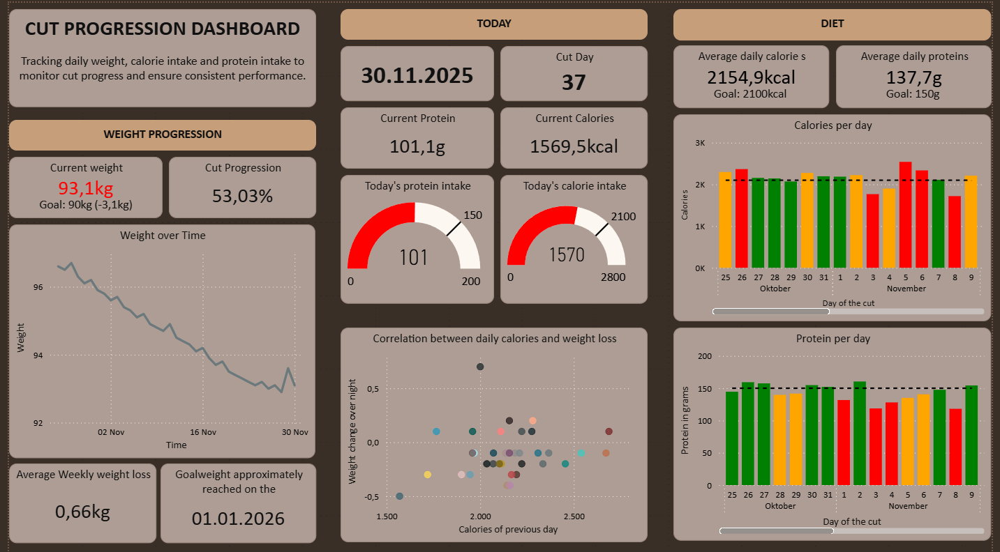

# Cut-Progress-Analysis (Excel, Power BI)

This project is an interactive Power BI dashboard designed to track and analyze fat loss/cutting progress.  
It connects to Google Sheets as a live data source and includes calculations for calories, protein, weight trends, and goal progression.

---

## Main Features

### **Weight Tracking**
- Daily weight trend line  
- KPI cards for start weight, current weight, and goal weight  
- Automatic calculation of total loss & progress percentage

### **Diet Tracking**
- Daily bar charts for calories and protein  
- Color-coded ranges (Green / Orange / Red) based on ±5% and ±10% deviation from goals  
- KPI cards for averages and daily targets

### **Daily Overview**
- Today's calories, protein, cut-day number  
- Day counting starts automatically from the earliest date in the dataset

---

## Data Source

The dashboard pulls data from Google Sheets:

- **Tracked Days** – daily calories, protein, weight  
- **Meals** – meals logged per day
- **Goals** – calorie, protein, and weight targets

---

## How to Use

### **1. Open the Power BI file**
Open: `Cut Progress Dashboard.pbix`

### **2. Update the data source (optional)**
If you want to use your own Google Sheet:

1. Power BI → *Transform Data*  
2. *Data Source Settings*  
3. Replace the Google Sheets link  
4. Refresh

### **3. Edit goals**
The `Goals` table lets you set:
- Daily calorie goal  
- Daily protein goal  
- Weight goal  
- Start weight

---

## License
Feel free to use or adapt this project.  
Credit is appreciated.
